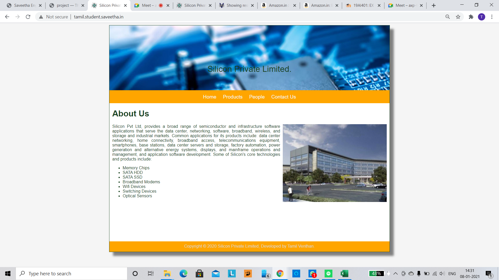
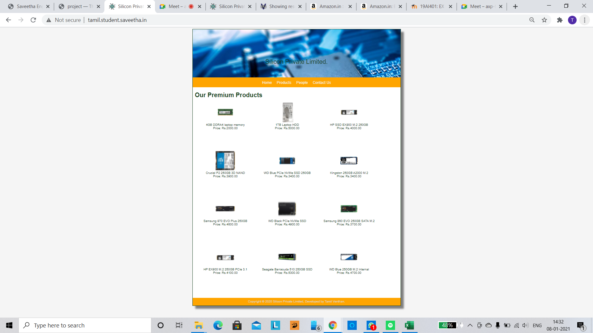
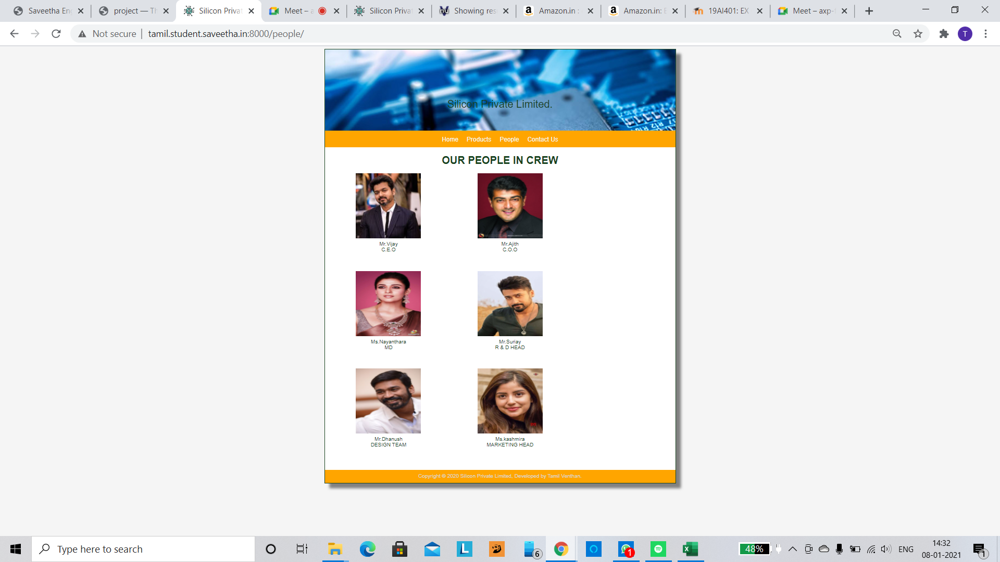
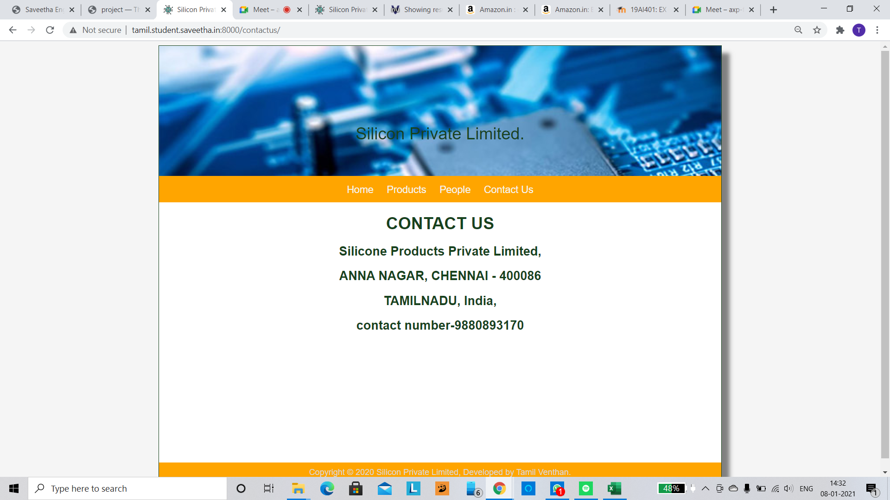
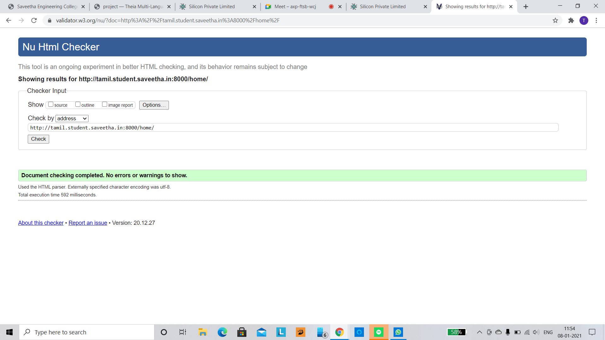
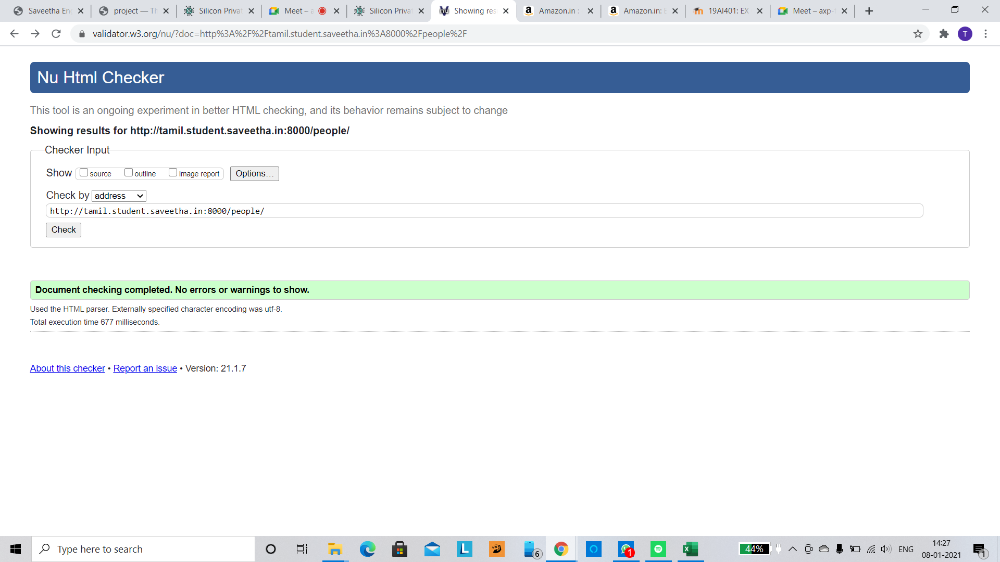

# Web Design for a Manufacturing Company
## AIM: 
To design a static website for a chip manufacturing company.

## DESIGN STEPS:
### Step 1: 
Requirement collection.
### Step 2:
Creating the layout using HTML and CSS.
### Step 3:
Updating the sample content.
### Step 4:
Choose the appropriate style and color scheme.
### Step 5:
Validate the layout in various browsers.
### Step 6:
Validate the HTML code.
### Step 6:
Publish the website in the given URL.

## PROGRAM:

### base.html
```



    <div class="homecontent">    
    <h1>About Us</h1>
    
    <div class="contenttext">
    Silicon Pvt Ltd, provides a broad range of semiconductor and infrastructure software applications that serve the data center, networking, software, broadband, wireless, and storage and industrial markets. Common applications for its products include: data center networking, home connectivity, broadband access, telecommunications equipment, smartphones, base stations, data center servers and storage, factory automation, power generation and alternative energy systems, displays, and mainframe operations and management, and application software development. Some of Silicon's core technologies and products include:
    <ul>
        <li>Memory Chips</li>
        <li>SATA HDD</li>
        <li>SATA SSD </li>
        <li>Broadband Modems</li>
        <li>Wifi Devices</li>
        <li>Switching Devices</li>
        <li>Optical Sensors</li>
    </ul> 
    </div>
    </div>

```
### products.html
```



    <div class="productcontent">    
    <h1>Our Premium Products</h1>
    <div class="productitems">
        <div class="productitem"> 
            <div class="itemimage">
            
            </div>
            <div class="itemname">4GB DDRA4 laptop memory</div>
            <div class="itemprice">Price: Rs.2000.00 </div>
        </div>
        <div class="productitem"> 
            <div class="itemimage">
            
            </div>
            <div class="itemname">1TB Laptop HDD</div>
            <div class="itemprice">Price: Rs.5000.00 </div>
        </div>
        <div class="productitem"> 
            <div class="itemimage">
            
            </div>
            <div class="itemname">HP SSD EX900 M.2 250GB</div>
            <div class="itemprice">Price: Rs.4000.00 </div>
        </div>
        <div class="productitem"> 
            <div class="itemimage">
            
            </div>
            <div class="itemname">Crucial P2 250GB 3D NAND</div>
            <div class="itemprice">Price: Rs.3900.00 </div>
        </div>
        <div class="productitem"> 
            <div class="itemimage">
            
            </div>
            <div class="itemname">WD Blue PCIe NVMe SSD 250GB</div>
            <div class="itemprice">Price: Rs.3400.00 </div>
        </div>
        <div class="productitem"> 
            <div class="itemimage">
            
            </div>
            <div class="itemname">Kingston 250GB A2000 M.2</div>
            <div class="itemprice">Price: Rs.3400.00 </div>
        </div>
        <div class="productitem"> 
            <div class="itemimage">
            
            </div>
            <div class="itemname">Samsung 970 EVO Plus 250GB </div>
            <div class="itemprice">Price: Rs.4600.00 </div>
        </div>
        <div class="productitem"> 
            <div class="itemimage">
            
            </div>
            <div class="itemname">WD Black PCIe NVMe SSD</div>
            <div class="itemprice">Price: Rs.4900.00 </div>
        </div>
        <div class="productitem"> 
            <div class="itemimage">
            
            </div>
            <div class="itemname">Samsung 860 EVO 250GB SATA M.2</div>
            <div class="itemprice">Price: Rs.3700.00 </div>
        </div>
        <div class="productitem"> 
            <div class="itemimage">
            
            </div>
            <div class="itemname">HP EX900 M.2 250GB PCIe 3.1</div>
            <div class="itemprice">Price: Rs.4100.00 </div>
        </div>
        <div class="productitem"> 
            <div class="itemimage">
            
            </div>
            <div class="itemname">Seagate Barracuda 510 250GB SSD </div>
            <div class="itemprice">Price: Rs.5300.00 </div>
        </div>
        <div class="productitem"> 
            <div class="itemimage">
            
            </div>
            <div class="itemname">WD Blue 250GB M.2 Internal</div>
            <div class="itemprice">Price: Rs.4700.00 </div>
        </div>
    </div> 
    </div>

```
## people.html
```



<div class="peoplecontent">
    <h1>OUR PEOPLE IN CREW</h1>
    <div class="crewmembers">
        <div class="crewmember">
            <div class="memberimage">
            
            </div>
            <div class="membername">Mr.Vijay</div>
            <div class="designation">C.E.O</div>
            </div>
        <div class="crewmember">
            <div class="memberimage">
            
            </div>
            <div class="membername">Mr.Ajith</div>
            <div class="designation">C.O.O</div>
        </div>
        <div class="crewmember">
            <div class="memberimage">
            
            </div>
            <div class="membername">Ms.Nayanthara</div>
            <div class="designation">MD</div>
        </div>
        <div class="crewmember">
            <div class="memberimage">
            
            </div>
            <div class="membername">Mr.Suriay</div>
            <div class="designation"> R & D HEAD </div>
        </div>
        <div class="crewmember">
            <div class="memberimage">
            
            </div>
            <div class="membername">Mr.Dhanush</div>
            <div class="designation"> DESIGN TEAM </div>
        </div>
        <div class="crewmember">
            <div class="memberimage">
            
            </div>
            <div class="membername">Ms.kashmira</div>
            <div class="designation"> MARKETING HEAD </div>
        </div>
    </div>
</div>



```
## contactus.html:
```



<div class="contactuscontent" align="center">    
    <h1>CONTACT US</h1>
    <div class="contactustext" align="center">
    <h2>Silicone Products Private Limited,</h2>
    <h2>ANNA NAGAR, CHENNAI - 400086</h2>
    <h2>TAMILNADU, India,</h2>
    <h2>contact number-9880893170</h2>

    </div>
   
    </div>

```
## OUTPUT:





## CODE VALIDATION REPORT:





## RESULT:
Thus a website is designed for the chip manufacturing company and is hosted in the URL http://tamil.student.saveetha.in:8000/. HTML code is validated.